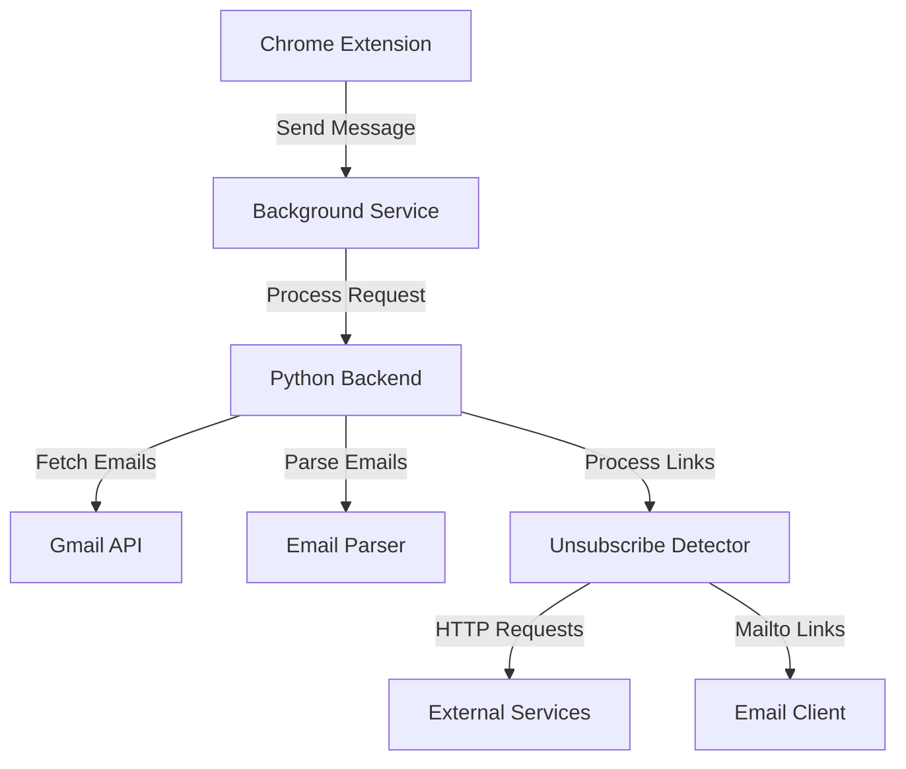

# Email Unsubscriber Chrome Extension

A Chrome extension that helps users manage email subscriptions by automatically detecting and processing unsubscribe links in emails.

## Features

- Scans emails for unsubscribe links and List-Unsubscribe headers
- Processes both HTTP and mailto unsubscribe methods
- Simple popup interface for initiating scans
- Visual feedback on processing status
- Python backend for email processing
- Gmail API integration

## Setup

### Prerequisites

- Python 3.8+
- Chrome browser
- Gmail account

### Installation

1. Clone the repository:
   ```bash
   git clone https://github.com/yourusername/email-unsubscriber.git
   cd email-unsubscriber
   ```

2. Set up Python environment:
   ```bash
   python3 -m venv venv
   source venv/bin/activate
   pip install -r requirements.txt
   ```

3. Configure Gmail API:
   - Create OAuth2 credentials in Google Cloud Console
   - Download credentials JSON file
   - Place credentials in `config/` directory

4. Load Chrome extension:
   - Open Chrome and navigate to `chrome://extensions/`
   - Enable Developer mode
   - Click "Load unpacked" and select the project directory

## Usage

1. Click the extension icon in Chrome
2. Click "Process Emails" to scan your inbox
3. View detected unsubscribe links
4. Click links to unsubscribe

## Architecture



## Configuration

Edit `config/settings.json` to customize:

- Email processing batch size
- Logging level
- Unsubscribe link patterns
- Request timeout settings

## Maintenance

### Updating OAuth Credentials

1. Generate new credentials in Google Cloud Console
2. Replace existing credentials file
3. Restart the extension

### Monitoring Logs

View logs in `logs/app.log` for:
- Processing statistics
- Error reports
- Debug information

## Contributing

Pull requests are welcome. For major changes, please open an issue first to discuss proposed changes.

## License

[MIT](https://choosealicense.com/licenses/mit/)
